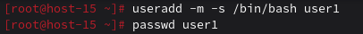
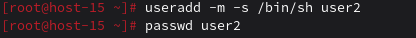
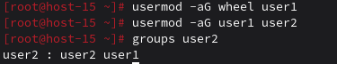
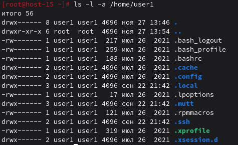
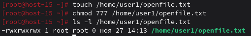
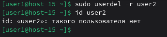
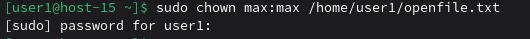

# Управление пользователями

## 1. Добавьте пользователей user1 и user2: 1.1) user1 - оболочка bash 1.2) user2 - оболочка sh 1.3) установите им пароли
### 1.1.

### 1.2.


## 2. Назначьте пользователю 1 группу администраторов, пользователя 2 добавьте в группу пользователя 1


## 3. Что такое права доступа? Выведите права доступа на файлы в директории пользователя
Права доступа определяют, кто и что может делать с файлом или каталогом:
- r (read) — читать
- w (write) — изменять
- x (execute) — запускать (файлы) или заходить внутрь (каталоги)

Права делятся на три категории:
- владелец (user)
- группа (group)
- все остальные (others)



## 4. Как изменить права на файлы? Создайте файл который будет на который у всез пользователей будут все возможные права
Права можно менять через команду `chmod`:

```bash
chmod [права] файл
```

Права можно задавать:
- символически: `chmod u=rwx,g=rwx,o=rwx файл`
- восьмеричной системой: `chmod 777 файл`

Создать файл, к которому у всех пользователей есть все права:



## 5. Как называется учётная запись встренного администратора в linux?
Учётная запись встроенного администратора называется `root`.

## 6. Как выполнить команду от имени администратора?
`sudo команда`<br>

Работает, если настроен sudo и пользователь в нужной группе.

## 7. Есть ли ограничения у суперпользователя?
Теоретически — нет: root может:

- читать/удалять любые файлы,
- завершать любые процессы,
- монтировать/размонтировать ФС,
- изменять права и владельцев.

Но на практике могут быть ограничения:

- SELinux / AppArmor — системы мандатного контроля доступа могут блокировать даже root.
- Неизменяемые файлы (chattr +i) — даже root не может их изменить без снятия атрибута.
- Отсутствие физического/сетевого доступа — если система заблокирована, root бессилен.

## 8. Удалите пользователя 2 с помощью пользователя 1.


## 9. Как можно изменить владельца папки? измените владельца папки из пункта 4
Передавать права собственности на файлы или папки от одного пользователя или группы к другому можно через команду `chown`:

```bash
sudo chown новый_владелец:новая_группа /путь/к/папке`
```

