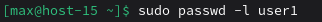

# Запрещаем

## 1. Запретите пользователю user1 из предыдщуего задания выполнять вход в систему


## 2. Как вы это сделали?
`passwd -l user1` — блокирует пароль, добавляя в начало хэша в /etc/shadow символ !.  

Пользователь не сможет войти по паролю (в том числе по SSH с паролем), но может использовать ключи SSH, если они настроены.

## 3. Какие ещё способы это сделать вы знаете?
```bash
sudo usermod -s /sbin/nologin user1
```
меняет оболочку пользователя на специальную программу, которая при попытке входа сразу завершает сессию с сообщением:
This account is currently not available.

## 4. Можно ли создать пользователей с одинаковыми username?
Нет, нельзя.

- Имя пользователя (username) должно быть уникальным в системе.
- Команда useradd (или adduser) откажет в создании пользователя с существующим именем.
- Это требование обеспечивается файлами /etc/passwd и /etc/shadow, где каждая запись идентифицируется по username.