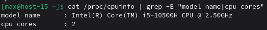

# ФС

## 1. Какие файловые системы вы знаете?
Дисковые файловые системы (хранят данные на носителях):
- ext2, ext3, ext4 — стандартные для Linux
- XFS, Btrfs, ReiserFS — альтернативы в Linux
- NTFS, FAT32, exFAT — от Microsoft (часто для флешек/внешних дисков)
- APFS, HFS+ — от Apple (macOS)
- ZFS — мощная ФС от Sun/Oracle (поддерживается в Linux)

Сетевые файловые системы:
- NFS (Network File System)
- CIFS/SMB (Common Internet File System / Server Message Block)

Виртуальные / псевдо-файловые системы (в оперативной памяти):
- procfs (/proc)
- sysfs (/sys)
- tmpfs (временная ФС в RAM)
- devtmpfs (/dev)

## 2. Как можно классифиировать файловые системы? в чём отличия??
- Дисковые (блочные) — хранят данные на постоянном носителе (HDD/SSD), например ext4, xfs, btrfs.
- Сетевые — дают доступ к файлам по сети (NFS, CIFS), зависят от сети и сервера.
- Псевдо-файловые — не хранят файлы на диске, а показывают данные ядра/системы как “файлы” (procfs, sysfs).
- В памяти — tmpfs хранит данные в RAM (обычно временно, до перезагрузки/размонтирования).

Отличия обычно по: где хранятся данные (диск/память/сеть/ядро), производительность, надёжность (журналирование), поддержка снапшотов/CoW и т.д.

## 3. Какие файловые системы используются в linux?
    ext4 - файловая система по умолчанию для многих дистрибутивов Linux, включая Debian и Ubuntu. Cтабильная, журналируемая, хорошо масштабируется.

    XFS - файловая система, которая обеспечивает чрезвычайную масштабируемость числа потоков ввода-вывода, пропускной способности файловой системы, а также размеров файлов и самой файловой системы при использовании нескольких физических устройств хранения.

    Btrfs - файловая система, которая предназначена для устранения отсутствия в файловых системах Linux таких возможностей, как объединение носителей в пул, снапшоты, проверка целостности, очистка данных и встроенная поддержка работы с несколькими устройствами хранения.

## 4. Как можно создать файловую систему на диске?
```bash
sudo mkfs.ext4 /dev/sdb1        # ext4
sudo mkfs.xfs /dev/sdb1         # XFS
sudo mkfs.ntfs /dev/sdb1        # NTFS (требуется пакет ntfs-3g)
```

## 5. Как можно подключить диск в систему, что такое монтирование?
Монтирование — это процесс привязки файловой системы (на диске, разделе, сетевом ресурсе) к определённой директории в дереве каталогов Linux.

```bash
sudo mkdir /mnt/mydisk
sudo mount /dev/sdb1 /mnt/mydisk
```
Теперь всё содержимое диска /dev/sdb1 доступно через /mnt/mydisk.

## 6. файловая система procfs, cifs, tpmfs,sysfs. В чём особенности каждой из них? Вывести каталоги к которым примонтированы эти файловые системы.

- procfs (proc) — псевдо-ФС с информацией о процессах и состоянии системы; обычно смонтирована в /proc.

- sysfs (sysfs) — псевдо-ФС для представления устройств и параметров ядра; обычно смонтирована в /sys.

- tmpfs (tmpfs) — ФС в оперативной памяти (RAM), используется для временных данных; часто встречается в /run, /dev/shm и т.п.

- cifs (cifs) — сетевая ФС для доступа к Windows/Samba-шарам по SMB/CIFS.

Вывести каталоги, куда они примонтированы, через таблицу монтирования:
`cat /proc/mounts | egrep ' (proc|sysfs|tmpfs|cifs) '` 

/proc/mounts содержит список текущих монтирований.

## 7. Как можно получить информацию о системе используя лишь команду cat? Вывести информацию о процессоре и состоянии памяти системы.
Информацию о процессоре и памяти можно прочитать из псевдофайлов в /proc:
```
cat /proc/cpuinfo
cat /proc/meminfo
```
Пример краткого вывода информации о процессоре:



