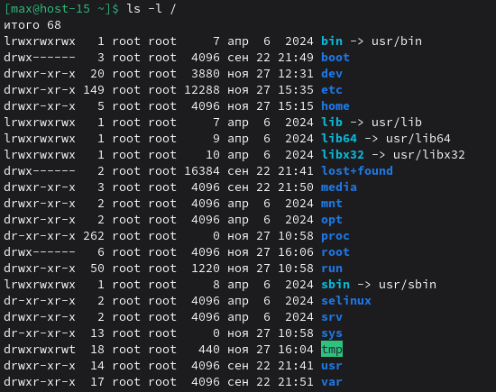

# Струтура каталогов

## 1. Какая структура каталогов в linux? Выведите список файлов в корне системы
В Linux используется иерархия каталогов, описанная стандартом FHS (Filesystem Hierarchy Standard): всё начинается с корневого каталога /.

## 2. Где хранятся папки пользователей в системе?
Домашние каталоги обычных пользователей хранятся в:

`/home/имя_пользователя`

## 3. Где домашняя папка суперпользователя?
Домашний каталог пользователя root — это:

`/root`

## 4. Где хранятся основые конфигурационные файлы в системе?
Основные конфигурационные файлы находятся в:

`/etc`

Примеры:
- `/etc/passwd` — учётные записи пользователей
- `/etc/group` — группы
- `/etc/fstab` — автоматическое монтирование дисков
- `/etc/hosts` — локальное разрешение имён
- `/etc/sudoers` — права sudo
- `/etc/network/` или `/etc/netplan/` — настройки сети

## 5. Что за папки /bin,/sbin,usr/sbin,/usr/sbin
- /bin содержит основные пользовательские команды нужные для работы системы и доступны всем пользователям.
- /sbin системные команды администратора, которые обычно используются суперпользователем.
- /usr/bin пользовательские программы и утилиты, устанавливаемые системой и пакетным менеджером.
- /usr/sbin административные системные утилиты, необязательные для загрузки системы.