# Продолжаем

## 1. Выведите содержимое fstab. Что хранится в fstab?

В /etc/fstab хранится список всех дисков, разделов, swap и виртуальных файловых систем с указанием, куда они монтируются, какой у них тип файловой системы, с какими параметрами монтирования, а также с настройками для проверки файловой системы при загрузке.

## 2. Добавьте в виртуальную машину ещё один диск
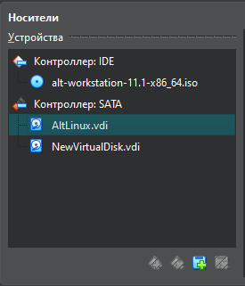

## 3. Узнайте как система видит ваш диск - выведите информацию о блочных устройствах
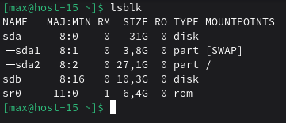

## 4. С помощью полученной информации создайте на диске таблицу разделов и фаловую систему ext4
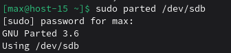

mklabel создаёт таблицу разделов (GPT), mkpart создаёт раздел, print показывает результат.

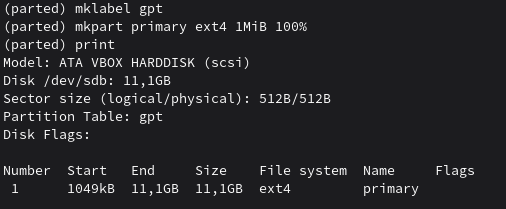

Создаём файловую систему ext4 на разделе

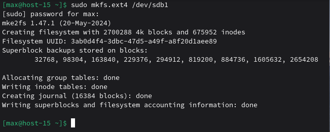

## 5. Примонитруте диск в каталог /mnt
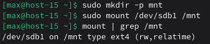

`mount` подключает файловую систему к каталогу (точке монтирования).

## 6. Зайдите в каталог и создайте там файлы
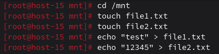

## 7. Отмонтируйте диск и проверье остались ли файлы
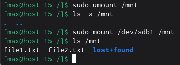

`umount` отключает файловую систему от точки монтирования.

Как видно, файлы не исчезли с диска, но без монтирования этот диск “не виден” по /mnt; после повторного mount они появятся снова.

## 8. Сделайте так, чтобы диск автоматически подключался при загрузке систем (добавьте информацию о нём с fstab)
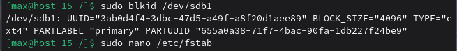

Узнаем UUID и вставляем его в `/etc/fstab`

## 9. Проверьте корректность записанных в fstab данных перед перезагрузкой
Смонтируем всё из fstab. Если в fstab ошибка, mount -a должен показать сообщение об ошибке. Если же ничего не показывает – всё в порядке.

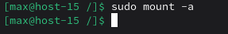

## 10. Перезагрузите систему и убедитесь, что диск был подключён к системе
Выполняем команду `sudo reboot` для перезагрузки системы.

После загрузки:

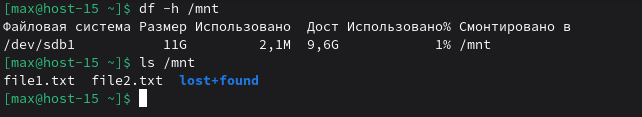

Диск смонтирован и файлы на месте.