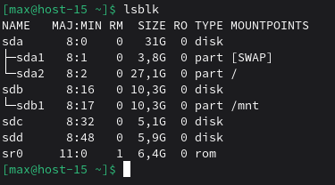
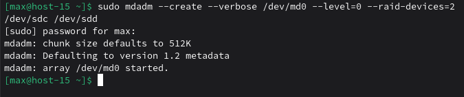
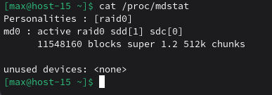
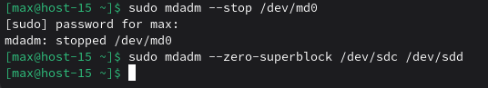
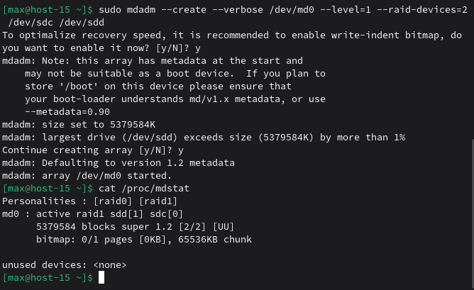

# Продолжаем

## 1. Raid массивы, что такое и какие бывают
RAID (Redundant Array of Independent Disks) — объединение нескольких физических дисков в один логический массив для повышения производительности и/или отказоустойчивости. 
Бывают уровни RAID 0, RAID 1, RAID 5, RAID 6, RAID 10 и другие.

## 2. Добавьте в виртуальную машину 2 диска отформатируйте их в ext4

## 3. Создайте из них raid 0 массив

## 4. Проверьте всё ли работает

## 5. Удалите raid0 и создайте raid1
Удаление raid0:

Создание raid1:

## 6. В чём между ними разница?
- RAID 0: данные распределяются по дискам (striping) → быстрее и объём суммируется, но отказ одного диска = потеря данных массива.

- RAID 1: данные зеркалируются (mirroring) → выдерживает отказ одного диска, но эффективный объём как у одного диска.

## 7. Есть ли файловые системы которые поддерживают raid массивы без стороннего ПО
Да, есть решения со “встроенным RAID” без mdadm, например Btrfs и ZFS (управляют несколькими дисками на уровне файловой системы/пула).

## 8. Можно ли создать raid массив во время установки системы?
Да, многие установщики Linux умеют на этапе разметки настроить программный RAID (mdadm), чтобы система установилась сразу на RAID.