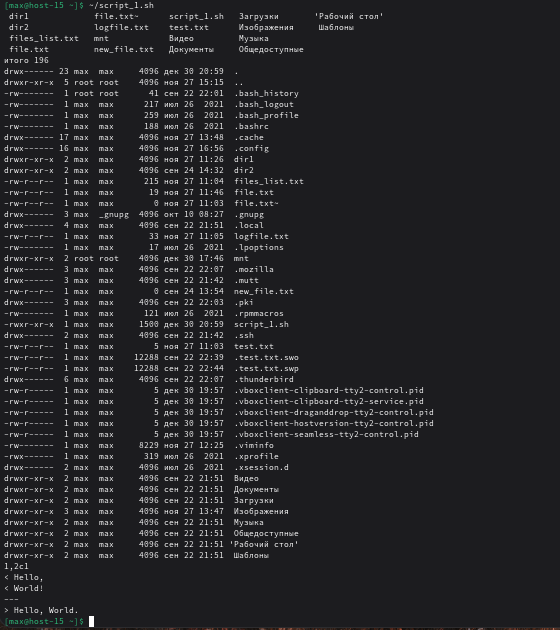

# Скриптуем по полной

## 1. Что такое шебанг?
Шебанг (или shebang) — это первая строка исполняемого скрипта, начинающаяся с #!, которая указывает системе, какой интерпретатор использовать для его запуска.

```
#!/bin/bash        # использовать Bash
#!/bin/sh          # использовать POSIX-совместимую оболочку
#!/usr/bin/env python3  # использовать Python 3 (через env для переносимости)
```

## 2. Обязательно ли исполняемый файл дожен иметь соотвествующее расширение?
Нет, не обязательно.

В Linux расширения файлов не имеют значения для определения типа файла или возможности его выполнения.

Важны:
- Биты исполнения (x в правах: chmod +x script)
- Наличие корректного шебанга

## 3. Напишите скрипт который выполнит автоматически действия из блока работы с файлами. ( не забудьте включить set -euo pipefail для того что бы ваш скрипт было удобнее отлаживать. Опишите что включают эти флаги)
```bash
#!/usr/bin/env bash
set -euo pipefail
# 1) Переместиться между директориями
cd ~
# 2) Вывести список файлов в директории
ls
# 3) Вывести список всех файлов в директории
ls -la
# 4) Создать папку с подпапками
WORKDIR="$HOME/lab_dirs"
mkdir -p "$WORKDIR/dir1/subdir"
mkdir -p "$WORKDIR/dir2"
# 5) Внутри папки создать файлик и записать в него что-нибудь
echo "Hello," >  "$WORKDIR/dir1/subdir/file.txt"
echo "World!"  >> "$WORKDIR/dir1/subdir/file.txt"
# 6) Переместить файл из одной директории в другую
mv "$WORKDIR/dir1/subdir/file.txt" "$WORKDIR/dir2/"
# 7) Скопировать файл из одной директории в другую
cp "$WORKDIR/dir2/file.txt" "$WORKDIR/dir1/subdir/file_copy.txt"
# 8) Переименовать файл
mv "$WORKDIR/dir2/file.txt" "$WORKDIR/dir2/file1.txt"
# 9) Сравнить содержимое файла (diff)
echo "Hello, World." >  "$WORKDIR/dir2/file2.txt"
diff "$WORKDIR/dir2/file1.txt" "$WORKDIR/dir2/file2.txt" || true
# 10) Отсортировать содержимое файла по возрастанию и убыванию
sort "$WORKDIR/dir2/file1.txt" >  "$WORKDIR/dir2/sorted_asc.txt"
sort -r "$WORKDIR/dir2/file1.txt" > "$WORKDIR/dir2/sorted_desc.txt"
# 11) Удалить все папки и файлы
rm -rf "$WORKDIR"
```
- `-e` - завершить скрипт, если команда вернула ненулевой код (ошибка).
- `-u` - считать ошибкой использование неинициализированных переменных.
- `-o pipefail` - возвращать код первой команды, которая завершилась с ошибкой, а не последней.

Запускаем:
```
chmod +x script_1.sh
~/script_1.sh
```


